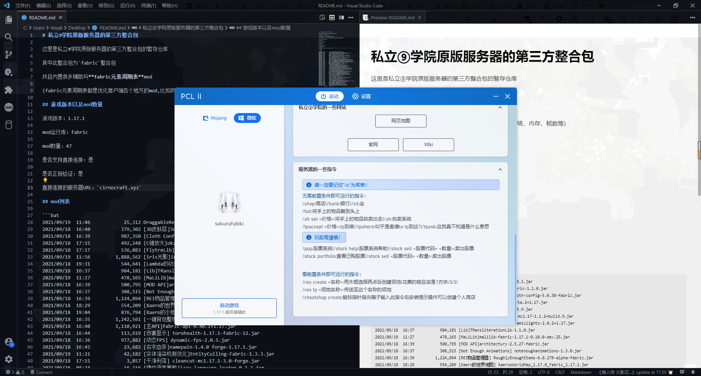

# 私立⑨学院原版服务器的第三方整合包

这里是私立⑨学院原版服务器的第三方整合包的暂存仓库

其中此整合包为 `fabric`整合包

并且内置很多辅助与**fabric元素周期表**mod

(fabric元素周期表都是优化客户端各个地方的mod,比如网络、内存、帧数等)

请进入`download`文件夹中下载，或者点击此处从镜像站下载[**1.19整合包**](https://ghproxy.futils.com/https://github.com/misaka10843/cache/blob/main/cirnocraft/download/1.19-cirnocraft.7z)

## 整合包未打包时链接(可issue或者PR提交好的mod等资源)

[就是在这里qwq](https://github.com/misaka10843/cache/blob/main/cirnocraft/zhenghebao)

或者您可以直接点击 `zhenghebao`的文件夹里面就是的啦！

## 游戏版本以及mod数量

游戏版本：1.19

mod运行库：fabric

mod数量：68

是否支持直接连接：是

是否正版验证：是

整合包类型：mcbbs整合包(类curseforge整合包)

直接连接的服务器URL：`cirnocraft.xyz`

---

游戏版本：1.17.1

mod运行库：fabric

mod数量：47

是否支持直接连接：是

是否正版验证：是

整合包类型：直接压缩

直接连接的服务器URL：`cirnocraft.xyz`

## 1.17.1注意

此仓库中的 `Custom.xaml`文件是 `PCL2`的主页文件，修改它就是会修改像下面这张图一样


您可以修改它，但是最好还是建议发送 `issue`来告诉我，十分感谢！

## mod列表

### 1.19

```bat
      LastWriteTime         Length Name
      -------------         ------ ----
2022/6/23     18:35         435895 3dskinlayers-fabric-1.4.7-mc1.19.jar
2022/6/23     18:43          23048 accurate-block-placement-1.0.13.jar
2022/6/23     18:35           7787 AmbientEnvironment-fabric-1.19-8.0+1.jar
2022/6/23     18:06          78206 antighost-1.19-fabric0.55.3-1.1.5.jar
2022/6/23     18:19          46798 appleskin-forge-mc1.19-2.4.0.jar
2022/6/23     18:32         551658 architectury-5.7.28-fabric.jar
2022/6/23     18:37        1024553 Autofish-0.9.5-fabric-mc1.19.jar
2022/6/23     18:41          62783 AutoHarvest-1.19.0.jar
2022/6/23     18:20          36991 AxolotlViewer-1.0.3.jar
2022/6/23     18:33          25470 badpackets-fabric-0.1.2.jar
2022/6/23     18:55         223222 betterbiomeblend-1.19.0-1.3.6-fabric.jar
2022/6/23     18:15        1419633 BetterF3-1.3.1-Fabric-1.19.jar
2022/6/23     18:22          17713 betterfpsdist-1.19-1.5.jar
2022/6/23     18:30          16272 BetterPingDisplay-Fabric-1.19-1.1.1.jar
2022/6/23     18:52          45200 bettertaskbar-fabric-1.18.2-1.4.jar
2022/6/23     18:10          30276 biomeinfo-1.19-11.jar
2022/6/23     18:17          26331 boathud-1.1.1.jar
2022/6/23     18:26         776264 bobby-4.0.0.jar
2022/6/23     18:50        1130241 c2me-fabric-mc1.19-0.2.0+alpha.8.2.jar
2022/6/23     18:42          17109 can-i-mine-this-block-1.3.0.jar
2022/6/23     18:16          25538 chat_heads-0.6.0-fabric-1.19.jar
2022/6/23     18:45         113164 clickthrough-1.19-fabric0.53.3-0.4.jar
2022/6/23     18:09        1126255 cloth-config-7.0.72-fabric.jar
2022/6/23     18:17          84513 cullleaves-2.3.4.jar
2022/6/23     18:22          56465 DetailArmorBar-2.6.2+1.19-fabric.jar
2022/6/23     18:55          25526 draggable-resource-packs-mc1.19-3.0.0+build.6.jar
2022/6/23     18:21         733307 eating-animation-1.8.1.jar
2022/6/23     18:21         269373 eatinganimation-1.19-3.0.0.jar
2022/6/23     18:07        1722841 effective-1.2.2.jar
2022/6/23     18:10          75567 entityculling-fabric-1.5.2-mc1.19.jar
2022/6/23     18:26          10173 Entity_Collision_FPS_Fix-forge-1.19-2.0.0.0.jar
2022/6/23     18:02        1486091 fabric-api-0.56.1+1.19.jar
2022/6/23     18:18        6311611 fabric-language-kotlin-1.8.0+kotlin.1.7.0.jar
2022/6/23     18:26          38539 fabrishot-1.8.0.jar
2022/6/23     18:08         143937 fallingleaves-1.12.1+1.19.jar
2022/6/23     18:49         119108 ferritecore-5.0.0-fabric.jar
2022/6/23     18:51         130940 flighthelper-1.19-fabric0.53.3-1.2.2.jar
2022/6/23     18:22         103108 FpsReducer2-fabric-1.19-2.0.1.jar
2022/6/23     18:23          44653 Gamma-Utils-1.6.8-mc1.19.jar
2022/6/23     18:51         901472 grasskiss-1.19-fabric0.53.3-0.5.0.jar
2022/6/23     18:14          58538 held-item-info-1.3.0.jar
2022/6/23     18:12          20418 idwtialsimmoedm-0.1.1+1.19.jar
2022/6/23     18:55          64277 imblockerfabric-1.0.18.jar
2022/6/23     18:08         118075 indium-1.0.6+mc1.19.jar
2022/6/23     18:06        1560460 InventoryProfilesNext-fabric-1.19-1.5.3.jar
2022/6/23     18:04        1561033 iris-mc1.19-1.2.5.jar
2022/6/23     18:08        1176944 lambdabettergrass-1.3.0+1.19.jar
2022/6/23     18:07         556414 lambdynamiclights-2.1.2+1.19.jar
2022/6/23     18:55          14531 lazydfu-0.1.3.jar.disabled
2022/6/23     18:09          10755 MiniEffects-1.18.2-fabric-4.1.0.jar
2022/6/23     18:06         303533 modmenu-4.0.0.jar
2022/6/23     18:15          11105 morechathistory-1.19-1.1.0.jar
2022/6/23     18:04          77282 MouseTweaks-fabric-mc1.19-2.22.jar
2022/6/23     18:18          75942 nbttooltips-0.1.2-1.19.jar
2022/6/23     18:30         570091 pickupnotifications-1.1.0+1.19.jar
2022/6/23     18:14        7214410 PresenceFootsteps-1.6.0.jar
2022/6/23     18:13          40585 reeses_sodium_options-1.4.3+mc1.19-build.43.jar
2022/6/23     18:31        1783908 RoughlyEnoughItems-9.0.491.jar
2022/6/23     18:13         205805 sodium-extra-0.4.5+mc1.19-build.43.jar
2022/6/23     18:04        1364166 sodium-fabric-mc1.19-0.4.2+build.16.jar
2022/6/23     18:49         127465 starlight-1.1.1+fabric.ae22326.jar
2022/6/23     18:45          16327 talkbubbles-1.0.2.jar
2022/6/23     18:51         725302 thorium-1.3.1.jar
2022/6/23     18:14          10838 tooltipfix-1.0.5-1.19.jar
2022/6/23     18:33         321960 wthit-fabric-5.4.3.jar
2022/6/23     18:34         662994 XaerosWorldMap_1.23.3_Fabric_1.19.jar
2022/6/23     18:34        1255681 Xaeros_Minimap_22.9.3_Fabric_1.19.jar
2022/6/23     18:18         294379 Zoomify-1.7.1.jar
```

### 1.17.1

```bat
2021/09/19  11:46            25,312 DraggableResourcePacks-1.0.1.jar
2021/09/18  16:40           379,302 [3D皮肤层]3dSkinLayers-Fabric-1.1.0.jar
2021/09/18  16:39           987,350 [Cloth Config(MOD)API] cloth-config-5.0.38-fabric.jar
2021/09/18  17:15           492,248 [C键放大]okzoomer-5.0.0-beta.2+1.17.jar
2021/09/18  17:17           536,083 [FlytreLib] flytre-lib-1.3.9.jar
2021/09/19  11:56         1,888,562 [iris光影]iris-and-sodium-mc1.17-1.1.2+build.9.jar
2021/09/18  19:31           544,641 [Lambda的动态光源] lambdynamiclights-2.0.2+1.17.jar
2021/09/18  16:37           984,181 [Lib]TRansliterationLib-1.1.0.jar
2021/09/19  11:27           478,165 [MaLiLib]malilib-fabric-1.17.1-0.10.0-dev.25.jar
2021/09/18  16:39           500,795 [MOD API]architectury-2.5.27-fabric.jar
2021/09/18  16:37           308,515 [Not Enough Animations] notenoughanimations-1.3.0.jar
2021/09/18  16:39         1,224,894 [REI物品管理器] RoughlyEnoughItems-6.0.279-alpha-fabric.jar
2021/09/18  18:29           554,209 [Xaero的世界地图] XaerosWorldMap_1.17.0_Fabric_1.17.1.jar
2021/09/18  19:04           876,794 [Xaero的小地图] Xaeros_Minimap_21.16.0_Fabric_1.17.1.jar
2021/09/18  16:35         1,242,561 [一键背包整理Next] InventoryProfilesNext-forge-1.17-1.0.2.jar
2021/09/18  16:40         1,110,921 [主API]fabric-api-0.40.1+1.17.jar
2021/09/18  16:44           113,619 [伤害显示] torohealth-1.17.1-fabric-12.jar
2021/09/18  16:36           977,882 [动态FPS] dynamic-fps-2.0.5.jar
2021/09/18  16:45            23,682 [名字血条]namepain-1.4.0 forge-1.17.1.jar
2021/09/19  11:21            42,182 [实体渲染机制优化]EntityCulling-Fabric-1.3.3.jar
2021/09/18  17:15             3,857 [干净利落] cleancut-mc1.17.1-3.0-forge.jar
2021/09/26  08:24            16,316 [惰性语言重载]lazy-language-loader-0.2.2.jar
2021/09/19  11:24         1,999,480 [我的mc客户端]oh-my-minecraft-client-1.17.1-0.3.8.jar
2021/09/18  19:06            71,584 [方块同步修复] antighost-1.17.1-fabric0.36.1-1.1.4.jar
2021/09/18  16:44            84,341 [无缝加载界面] seamless-loading-screen-1.3.6+1.17.1.jar
2021/09/18  16:36         1,248,501 [更好的F3] betterf3-1.1.5+1.17.jar
2021/09/18  16:38            14,491 [更好的延迟显示] BetterPingDisplay-1.17.1-1.0.jar
2021/09/19  11:03            21,146 [更好的延迟显示]BetterPingDisplay-Fabric-1.17.1-1.1.jar
2021/09/18  17:17         1,182,521 [更好的草方块]lambdabettergrass-1.2.1+1.17.jar
2021/09/18  16:37           450,633 [更真实的第一人称模型] FirstPersonMod-2.0.3.jar
2021/09/19  11:21         7,219,696 [更真实的脚步声]PresenceFootsteps-r32-1.17-rc1.jar
2021/09/19  11:52           103,122 [木牌穿透]clickthrough-1.17.1-fabric0.36.1-0.4.jar
2021/09/18  16:37           258,289 [模组菜单] modmenu-2.0.11.jar
2021/09/19  11:04           118,554 [氢]hydrogen-fabric-mc1.17.1-0.3.jar
2021/09/19  11:09           127,183 [氪]krypton-0.1.4.jar
2021/09/19  11:46           225,406 [物品栏HUD+] InventoryHUD-fabric-[1.17.x]-3.4.0.jar
2021/09/18  16:36            30,109 [物品模型修复] item-model-fix-1.0.2+1.17.jar
2021/09/18  16:39           258,867 [玉 🔍] Jade-1.17.1-3.1.5.jar
2021/09/18  17:17           482,694 [生物血条] salutem-1.17.1-1.2.1.jar
2021/09/18  16:38            43,661 [美西螈桶修复] axolotl-item-fix-1.1.2.jar
2021/09/19  11:02           151,373 [耐久信息显示] durabilityviewer-1.17.1-fabric0.36.1-1.10.1.jar
2021/09/18  16:40           904,584 [自动钓鱼] Autofish-0.9.3-fabric-mc1.17.jar
2021/09/18  16:46           291,971 [落叶]fallingleaves-1.7.3+1.17.1.jar
2021/09/26  08:00           248,970 [那到底是什么]wthit-fabric-3.9.1.jar
2021/09/19  11:21         1,127,731 [隐藏盔甲]HideArmor-Fabric-1.17.1-2.4.jar
2021/09/26  07:59            59,783 [音频驱动重载]reloadAudioDriver-1.0.1.jar
2021/09/18  16:38            58,867 [鼠标手势] MouseTweaks-2.14-mc1.17.1.jar
              47 个文件     30,095,628 字节
```

## 一些截图




## 参与制作人员

- misaka10843

## 感谢

感谢 `PCL2`启动器能够支持分发服务！
